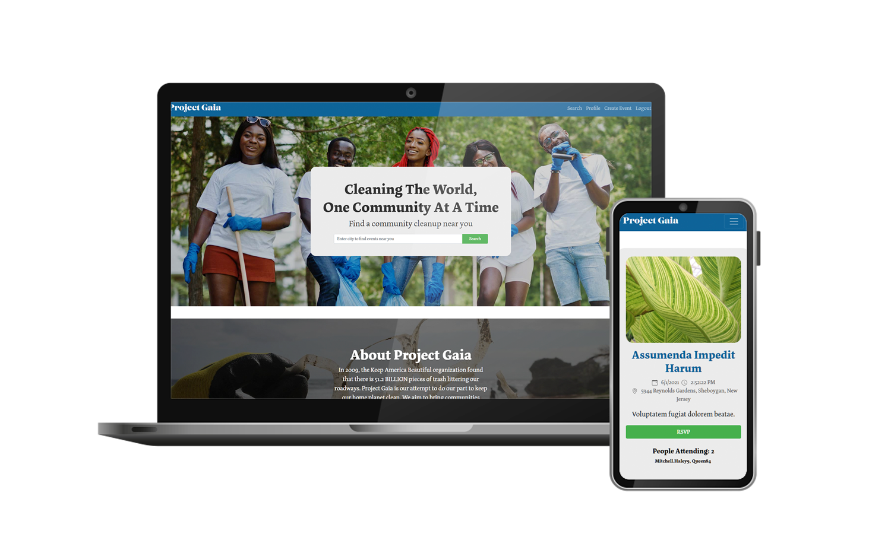

# Project Gaia

  

## Table of Contents

- [Description](#description)
- [Deployed Application](#deployed-application)
- [User Story](#user-story)
- [Technology Used](#technology-used)
- [Contributors](#contributors)

## Description:

Project Gaia is a MERN-stack website built to bring communities together with the goal of cleaning up our neighborhoods to leave a cleaner planet for future generations.

## Deployed Application:

[Project Gaia](https://projectgaia.herokuapp.com/)

## User Story:

AS A nature lover  
I WANT a place online to organize environmental cleanups  
SO THAT I can help keep our neighborhoods and communities free of trash and clean for future generations

## Technology Used:

## Contributors:

- [Melanie Arnold](https://github.com/einalem4)
- [Nikki Goodridge](https://github.com/NGoody315)
- [Ian Jackson](https://github.com/ijacksondesign)
